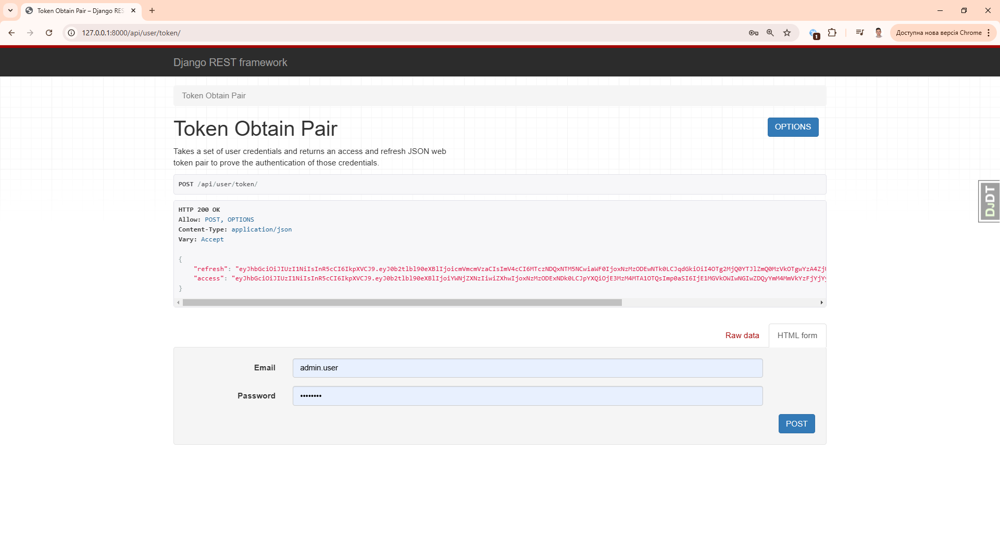

# Airport service Project
<hr>

DRF project for airport service

## Installation

Python 3 must be already installed

```commandline
git clone https://github.com/MaksymProtsak/airport-service.git
cd airport-service
python -m venv venv
venv\Scripts\activate
pip install -r requirements.txt
python manage.py runserver  # starts Django Server
```

## Run with docker
<hr>

```commandline
docker-compose build
docker-compose up
```

## Getting access
<hl>

* created user via /api/user/register/
* get access token via /api/user/token/
* refresh access token via /api/user/token/refresh/

## Features

* Authentication functionality for Customer/Admin
* Managing airports, routes, tickets, orders, flights, airplane types, airplanes, crews and flights directly from website interface
* Powerful admin panel form advanced managing
* Documentation is located at api/doc/swagger/

## Demo
Login user succeed 


User info page


Token refresh page


Airport app routes


Crew list


Airplane type list


Airplane type list


Order list


Airplane list


Airport list


Route list


Flight list
